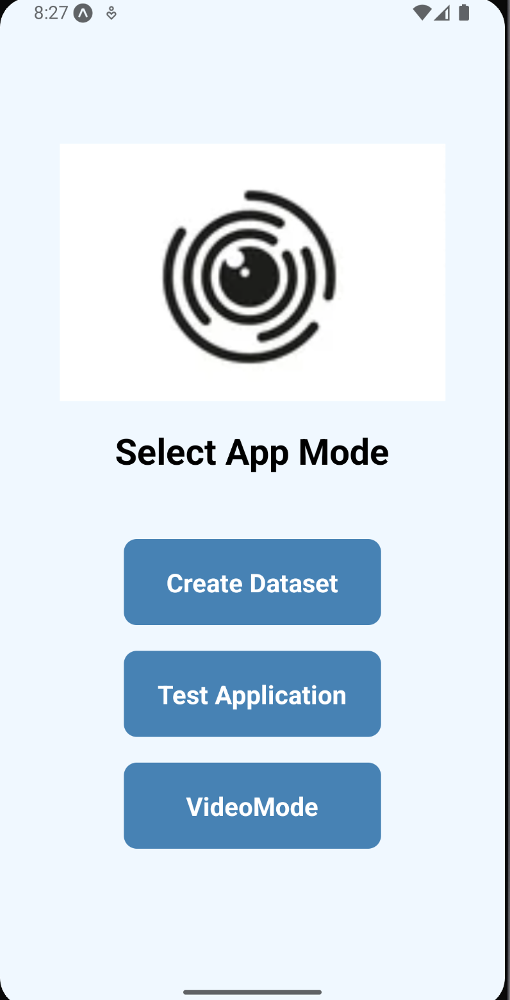

# 👁️ Eye Gaze Tracking App

A cross-platform Android app built using **React Native** and a **Flask backend** to enable **hands-free screen control and text input** through real-time **eye gaze estimation**. This project combines mobile development with **deep learning**, **MediaPipe**, and **OpenCV** to create an accessible and intelligent interaction system.

---

## 🚀 Features

* 👀 **Real-Time Eye Tracking**
  Track eye movements using front-facing camera for on-screen cursor control and typing.

* 📱 **Cross-Platform Frontend**
  Developed in React Native for sleek and responsive mobile UI.

* 🧠 **CNN-Based Gaze Estimation**
  Trained a deep learning model on a custom dataset to predict screen coordinates with **98.87% accuracy**.

* 🔧 **Backend API with Flask**
  Fast and scalable API for inference and control communication.

---

## 🧰 Tech Stack

| Layer       | Tools & Libraries                           |
| ----------- | ------------------------------------------- |
| Frontend    | React Native, Expo, Axios                   |
| Backend     | Flask, Flask-CORS, Gunicorn                 |
| ML / Vision | Python, TensorFlow/Keras, MediaPipe, OpenCV |
| Data        | 10,000+ labeled eye images (custom dataset) |

---

## 🧠 How It Works

1. **Face & Eye Detection (MediaPipe)**

   * Detect facial landmarks (eyes, iris, etc.) from camera frames.
   * Crop eye regions dynamically based on landmark bounding boxes.

2. **Preprocessing (OpenCV)**

   * Resize, normalize, and align eye images.
   * Handle glare, lighting variations, and occlusions.

3. **Model Prediction (CNN)**

   * Feed preprocessed eye images into a trained CNN model.
   * Predict (x, y) gaze coordinates on the screen.

4. **React Native UI**

   * Display cursor based on prediction.
   * Enable eye-based interaction for text input and control.

---

## 🧪 Model Performance

* **Architecture:** Convolutional Neural Network (CNN) with batch norm, dropout, and ReLU activations.
* **Training Data:** 10,000+ labeled eye-region images.
* **Test Accuracy:** **98.87%** for screen coordinate prediction.

---

## 📲 Installation & Usage

### 📦 Requirements

* Node.js + Expo CLI
* Python 3.8+
* Flask + Required Python packages (`requirements.txt`)

### 🧑‍💻 Steps

```bash
# Clone the repository
git clone https://github.com/yourusername/eye-gaze-tracker.git
cd eye-gaze-tracker

# Setup backend
cd backend/
pip install -r requirements.txt
python app.py

# Setup frontend
cd ../frontend/
npm install
npx expo start
```

Make sure to allow camera access on your device.

---

## 📸 Screenshots




---

## 📚 Learnings & Challenges

* Learnt real-time face landmark detection using MediaPipe.
* Handled diverse lighting conditions and user positions for robust gaze tracking.
* Tuned CNN model for high-accuracy, low-latency inference on mobile.

---

## 🤝 Contribution

Have suggestions, want to improve accuracy, or extend it to desktop? Contributions are welcome!
Feel free to fork, submit PRs, or open issues.

---

## 📄 License

MIT License. See `LICENSE.md` for more details.

